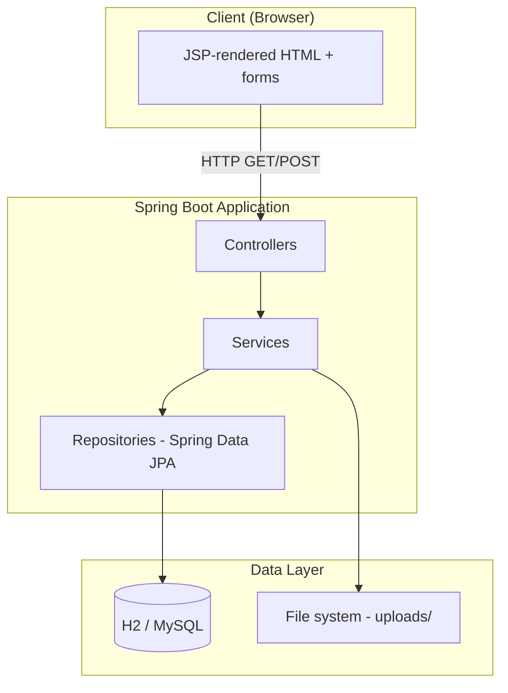
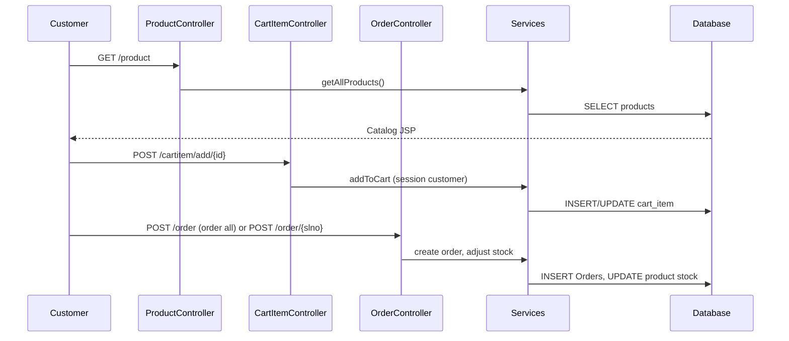
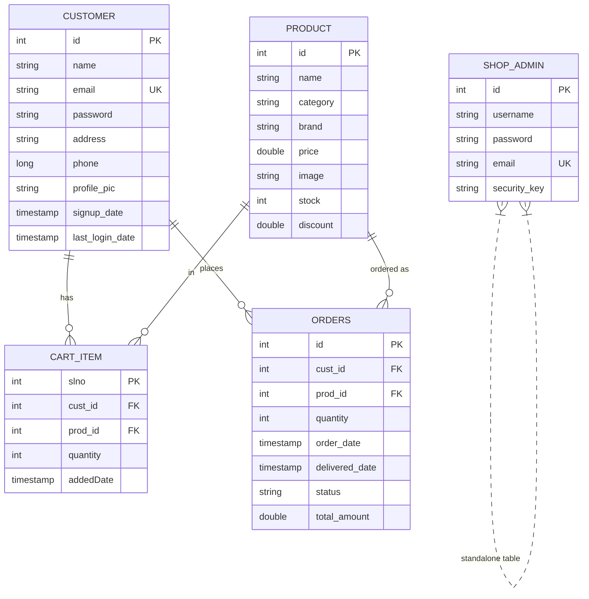

# ShopKart — E-Commerce Web Application

## Engineering Project Report (Thesis Format)

---

## 1. Title Page

**Project Title:** ShopKart — Web-Based E-Commerce Application Using Spring Boot  

**Domain:** E-Commerce / Information Technology  

**Technologies Used:** Java 17, Spring Boot 3.3.4, Spring MVC, Spring Data JPA, Hibernate, JSP, HTML/CSS/JavaScript, Maven, H2 / MySQL, Docker & Docker Compose, Spring Security (filter chain with permissive configuration), BCrypt-compatible password encoding  

**Developed By:** [YOUR NAME]  
*(Original academic context: group “Spring Spartans,” course Information Processing for Web, BTech IT — adapt as required.)*

**Organization / College:** [COLLEGE NAME]  

**Duration:** [PROJECT DURATION, e.g., August 2025 – April 2026]  

**Supervisor / Guide:** [SUPERVISOR NAME]  

**Academic Year:** [e.g., 2025–2026]  

---

## 2. Certificate Page

*[Institution letterhead]*  

**Certificate**  

This is to certify that the project report entitled **“ShopKart — Web-Based E-Commerce Application Using Spring Boot”** submitted by **[YOUR NAME]** in partial fulfillment of the requirements for the award of **[DEGREE NAME]** is a record of bona fide work carried out under my supervision.

**Signature of Guide:** _________________________  
**Name:** _________________________  
**Designation:** _________________________  
**Date:** _________________________  

**Signature of Head of Department:** _________________________  
**Date:** _________________________  

---

## 3. Declaration

I hereby declare that this project report titled **ShopKart — Web-Based E-Commerce Application Using Spring Boot** is my own original work. The implementation, analysis, and documentation have been carried out by me under the guidance of my supervisor. Sources of information and assistance from others have been duly acknowledged. This work has not been submitted elsewhere for any other degree or diploma.

**Place:** _______________  
**Date:** _______________  

**Signature of Student:** _______________  
**Name:** [YOUR NAME]  
**Roll / Registration No.:** _______________  

---

## 4. Acknowledgment

I express my sincere gratitude to my project guide for continuous support, constructive feedback, and encouragement throughout this work. I thank the faculty and staff of **[DEPARTMENT]** for providing the laboratory and library facilities required for the project. I acknowledge the open-source community and the documentation for Spring Boot, JPA, and related tools that made learning and implementation efficient. Finally, I thank my family and peers for their patience and motivation.

---

## 5. Abstract

Electronic commerce has become a fundamental channel for retail and service delivery. Small and medium businesses, as well as academic institutions, require demonstrable yet practical systems that illustrate catalog management, user accounts, shopping carts, and order workflows without the complexity of full payment-gateway integration in early learning stages.

**ShopKart** is a full-stack style web application built on **Java** and **Spring Boot**, following a classic **Model–View–Controller (MVC)** pattern. The **view** layer uses **JavaServer Pages (JSP)** with server-side rendering; the **controller** layer maps HTTP routes to business operations; the **service** layer encapsulates rules for authentication, catalog, cart, and orders; and **Spring Data JPA** repositories persist entities in a **relational database** (in-memory **H2** for development, or **MySQL** for deployment scenarios supported via configuration and **Docker Compose**).

The system distinguishes **customers** and **administrators** through separate entities and session attributes rather than a single unified user table with role-based Spring Security. Customers register, log in, browse and search products, manage a per-user cart, place orders (with assumed instant payment for educational scope), and update profiles including optional image upload. Administrators authenticate with an additional **security key**, access a dashboard with sales and activity metrics, manage the product catalog with image uploads, view customers, and update or cancel orders.

Security considerations include **BCrypt-style password hashing**, validation of uploads, and controller-level authorization checks. **Spring Security** is present but configured to **permit all requests** and disable default login, CSRF, and HTTP Basic, so access control is implemented explicitly in application code—a design choice suitable for discussion in terms of trade-offs for production hardening.

The report documents requirements analysis, system design including database schema and request flows, implementation details, sample test cases, results, conclusions, and future enhancements such as REST APIs, OAuth2, payment integration, and comprehensive automated testing.

**Keywords:** E-commerce, Spring Boot, JSP, JPA, Session-based authentication, MVC, MySQL, Docker.

---

## Chapter 1: Introduction

### 1.1 Project Overview

ShopKart simulates an online store where end users interact through a browser. The server runs a Spring Boot application packaged as a **WAR**-compatible project using embedded Tomcat. Pages are generated using JSP views under `src/main/webapp/view/`. Static and uploaded product or profile images are served from a configurable project-relative **uploads** directory.

The application supports:

- Customer **registration** and **login** with session tracking (`loggedInCustomer`).
- **Product catalog** with category filter and prefix search.
- **Shopping cart** with add, quantity change, and line removal, constrained by stock.
- **Orders** with status lifecycle (Pending, Shipped, Delivered, Cancelled), order-from-cart, reorder, and cancellation for the logged-in customer.
- **Admin** login with **security key**, dashboard analytics, CRUD-style product management, customer listing and deletion, and global order management.

### 1.2 Problem Statement

Traditional retail faces limitations in reach, operating hours, and scalability. Web applications can address these by offering 24/7 access and centralized inventory visibility. For academic and prototyping contexts, students need a **coherent** example that combines:

- Persistent storage of users, products, carts, and orders.
- Clear separation of **customer** vs **admin** capabilities.
- Realistic flows (browse → cart → order) without mandating payment-provider certification.

ShopKart addresses this by providing a **self-contained** demonstrator that can run locally (H2) or with MySQL via Docker.

### 1.3 Objectives

1. To design and implement a three-tier style web application using Spring Boot MVC and JPA.
2. To model e-commerce data (customers, products, cart lines, orders, admins) in a normalized relational schema.
3. To implement **session-based** authentication for customers and administrators with password hashing.
4. To provide administrative tools for catalog maintenance and order oversight with simple analytics.
5. To document architecture, endpoints, database design, testing, and limitations for academic evaluation.

---

## Chapter 2: Literature Survey

### 2.1 Existing Systems

- **Large e-commerce platforms** (e.g., marketplace operators) offer payment, logistics, reviews, and seller onboarding—far beyond a teaching prototype.
- **Headless commerce** APIs separate frontend (React, mobile) from backend microservices; useful for scale but heavier for introductory MVC courses.
- **Monolithic MVC applications** with server-side templates remain common in curricula because they make request–response flow and session concepts visible in one codebase.

### 2.2 Limitations of Comparable Academic Projects

Many student projects either:

- Store passwords in plain text (insecure),
- Lack distinct admin workflows,
- Omit stock constraints or order state,
- Or use only static HTML without a real persistence layer.

ShopKart intentionally includes **hashed passwords**, **stock-aware** cart updates, **order status**, and a separate **admin** model to mitigate these gaps while remaining deployable as a demo.

---

## Chapter 3: System Analysis

### 3.1 Current System (Manual / Informal)

Without a digital system, inventory and orders may be tracked on paper or spreadsheets, leading to errors, duplication, and poor visibility for customers.

### 3.2 Proposed System

A centralized web application where:

- Product data is authoritative in the database.
- Each customer sees only their own cart and orders.
- Administrators maintain catalog and monitor orders through a dedicated dashboard.

### 3.3 Advantages

- **Consistency:** Single source of truth for products and stock.
- **Traceability:** Orders linked to customers and products with timestamps and status.
- **Scalability of design:** Database and service layers can evolve toward APIs and microservices.
- **Portability:** Can run on developer machines (H2) or containerized MySQL.

---

## Chapter 4: System Design

### 4.1 Architecture Description

The system follows **layered architecture**:



**Description:** The browser submits form and link requests. Controllers validate presence of session where required, invoke services, attach attributes to the `Model`, and return **view names** resolved to JSP paths (`spring.mvc.view.prefix=/view/`, `suffix=.jsp`). Services coordinate repositories and file I/O for images. JPA maps entities to tables; Hibernate can auto-create schema in development (`ddl-auto=create-drop` with `data.sql` seeding).

### 4.2 High-Level Request Flow (Customer Purchase)



### 4.3 Admin Access Flow


Administrative pages re-verify that `adminService.getAdmin()` is non-null and that a logged-in **customer** alone cannot access admin routes (HTTP 403).

### 4.4 Modules Description

| Module | Primary classes | Responsibility |
|--------|-----------------|----------------|
| Customer account | `CustomerController`, `CustomerService` | Login, signup, profile update, logout |
| Catalog | `ProductController`, `ProductService` | List, detail, category filter, search |
| Cart | `CartItemController`, `CartItemService` | Cart CRUD, quantity, stock checks |
| Orders | `OrderController`, `OrderService` | Place order, history, summary, cancel, reorder, status filter |
| Admin | `AdminController`, `AdminService` | Login with security key, dashboard, catalog/customer/order management |
| Security config | `SecurityConfig` | Permits all URLs; CSRF disabled; custom session auth in controllers |
| Utilities | `PasswordEncoder`, `PasswordValidator`, `ImageUploadValidator` | Hashing, password rules, image validation |

### 4.5 Database Design

#### 4.5.1 Entity–Relationship (Conceptual)



**Note:** Hibernate maps Java entity names to tables `customer`, `product`, `cart_item`, `Orders`, `shop_admin` (exact names follow `@Table` annotations).

#### 4.5.2 Table Summaries

**customer** — Stores registered shoppers. Password column holds a **BCrypt hash** (length up to 72). Email is unique.

**product** — Catalog item with price, optional image filename, stock, and discount percentage.

**cart_item** — Lines keyed by `slno`; foreign keys to customer and product; quantity and `addedDate`.

**Orders** — One row per order line (product + quantity + amount); `status` enum stored as string; links to `customer` and `product`.

**shop_admin** — Administrator credentials plus `security_key` used at login.

### 4.6 Diagrams for Figures Section (Screenshots)

*The following placeholders are for your thesis PDF/Word. Create a folder `docs/thesis-figures/`, add PNG/JPG exports from your running app (default port in `application.properties` is **8099**), and embed them in the final document.*

| Fig. ID | Suggested capture | File name (example) |
|---------|-------------------|----------------------|
| Fig. 4.1 | Customer login page (`http://localhost:8099/`) | `fig4-1-customer-login.png` |
| Fig. 4.2 | Customer signup | `fig4-2-signup.png` |
| Fig. 4.3 | Product catalog (`/product`) | `fig4-3-catalog.png` |
| Fig. 4.4 | Product detail + Add to cart | `fig4-4-product-detail.png` |
| Fig. 4.5 | Shopping cart (`/cartitem/cart`) | `fig4-5-cart.png` |
| Fig. 4.6 | Order history (`/order`) | `fig4-6-orders.png` |
| Fig. 4.7 | Order summary (`/order/{id}`) | `fig4-7-order-summary.png` |
| Fig. 4.8 | Profile update (`/update`) | `fig4-8-profile.png` |
| Fig. 4.9 | Admin login (`/admin`) | `fig4-9-admin-login.png` |
| Fig. 4.10 | Admin dashboard | `fig4-10-admin-dashboard.png` |
| Fig. 4.11 | Manage products (admin) | `fig4-11-admin-products.png` |

**Markdown embed example (after you save images):**

```markdown

*Figure 4.1: Customer login screen.*
```

---

## Chapter 5: Implementation

### 5.1 Technology Stack Explanation

- **Java 17 & Spring Boot 3.3.4:** Runtime and application framework with auto-configuration.
- **Spring Web MVC:** `@Controller`, `Model`, view resolution to JSP.
- **Spring Data JPA:** Repository interfaces, derived queries, native queries where used.
- **Hibernate:** ORM; DDL generation in dev; entities define relationships and cascades.
- **H2 / MySQL:** H2 in-memory with console at `/h2-console` for local demos; MySQL supported via datasource properties; **Docker Compose** provisions MySQL 8 and app container with profile `docker`.
- **Tomcat Jasper:** JSP compilation support (`tomcat-jasper` dependency).
- **Spring Security:** Global filter chain permits all; CSRF off; application-level session checks.

### 5.2 Backend — Routes and Behavior

The application primarily uses **server-side form posts** and **redirects**, not JSON REST controllers. The table below lists **representative** HTTP routes (method + path) aligned with the source code.

#### 5.2.1 Customer and Catalog

| Method | Path | Purpose |
|--------|------|---------|
| GET | `/` | Customer login page |
| POST | `/login` | Authenticate; sets session `loggedInCustomer`; redirect `/product` |
| GET | `/signup` | Registration form |
| POST | `/signup` | Create customer (password validation + hash) |
| GET | `/update` | Profile form (requires customer session) |
| POST | `/update` | Update profile / optional profile picture |
| GET | `/logout` | Invalidate session |
| GET | `/product` | Catalog |
| GET | `/product/{id}` | Product details |
| GET | `/product/category/{category}` | Filter by category |
| GET | `/product/search?prefix=...` | Search by name prefix |

#### 5.2.2 Cart

| Method | Path | Purpose |
|--------|------|---------|
| GET | `/cartitem/cart` | View cart (401 if not logged in) |
| POST | `/cartitem/add/{prod_id}` | Add product for logged-in customer |
| POST | `/cartitem/increase/{slno}` | Increment qty (stock limited) |
| POST | `/cartitem/decrease/{slno}` | Decrement qty |
| POST | `/cartitem/delete/{slno}` | Remove line |

#### 5.2.3 Orders

| Method | Path | Purpose |
|--------|------|---------|
| GET | `/order` | Order history and status counts |
| GET | `/order/{id}` | Single order summary |
| POST | `/order` | Order all cart lines |
| POST | `/order/{slno}` | Order single cart line |
| POST | `/order/again/{id}` | Reorder from past order |
| POST | `/order/cancel/{id}` | Cancel order |
| GET | `/order/status/{status}` | Filter customer orders by status |

#### 5.2.4 Admin

| Method | Path | Purpose |
|--------|------|---------|
| GET | `/admin` | Admin login |
| GET | `/admin/login` | Query-param login (email, password, security_key) |
| GET | `/admin/logout` | Logout |
| GET | `/admin/dashboard` | Metrics (403 if customer-only session) |
| GET | `/admin/dashboard/product`, `/add`, `/update/{id}` | Product UI |
| POST | `/admin/dashboard/product/add`, `/update/{id}`, `/delete/{id}` | Product mutations |
| GET/POST | `/admin/dashboard/customer`, `/delete/{id}` | Customer list / delete |
| GET/POST | `/admin/dashboard/order`, filters, `/update/{id}`, `/cancel/{id}` | Order management |

### 5.3 “REST-Style” Illustration (Conceptual)

Although the thesis uses **HTML forms**, a future REST API might expose JSON. Below is a **fictional** example for documentation practice (not implemented as `@RestController` in this project):

**Example (hypothetical):** `POST /api/v1/auth/login`  
Request body:

```json
{ "email": "user@gmail.com", "password": "password" }
```

Response:

```json
{ "success": true, "message": "Session established", "redirect": "/product" }
```

In the **actual** ShopKart implementation, login is `POST /login` with form fields `email` and `password`, and the server issues an HTTP redirect with a **session cookie**.

### 5.4 Frontend

Views are **JSP** pages under `src/main/webapp/view/` grouped as `customer/`, `product/`, `cartitem/`, `order/`, `admin/`. CSS and client scripts support layout and basic interactivity. No separate SPA framework is required.

### 5.5 Database Integration

- `application.properties` configures datasource, JPA, multipart uploads, and `file.project-path` / `file.image-path` for storing uploaded images under `uploads/`.
- `data.sql` seeds a demo customer, admin, and sample products when the schema is created.

**Demo credentials (from project comments / seed data):**

- Customer: email `user@gmail.com`, password `password` (hashed in DB).
- Admin: email `admin@shopkart.local`, password `password`, security key `admin-secret-key`.

---

## Chapter 6: Testing

### 6.1 Test Cases (Sample)

| TC ID | Module | Precondition | Steps | Expected Result |
|-------|--------|--------------|-------|-----------------|
| TC-01 | Customer | None | Open `/`, submit valid credentials | Redirect to `/product`, session active |
| TC-02 | Customer | None | Submit wrong password | Redirect to `/?msg=failed` |
| TC-03 | Customer | None | Register new user on `/signup` | User created; password hashed in DB |
| TC-04 | Product | Logged in | Open `/product`, click category | Filtered list |
| TC-05 | Product | Logged in | `/product/search?prefix=Lap` | Matching products |
| TC-06 | Cart | Logged in | POST add to cart from detail | Line appears in `/cartitem/cart` |
| TC-07 | Cart | Item in cart | Increase qty beyond stock | Flash error, qty capped by stock |
| TC-08 | Order | Cart non-empty | POST `/order` | Orders created, cart cleared appropriately per service logic |
| TC-09 | Order | Has orders | GET `/order/{id}` | Summary visible for own order |
| TC-10 | Order | Own pending order | POST `/order/cancel/{id}` | Status becomes Cancelled |
| TC-11 | Admin | None | `/admin/login` with wrong key | Redirect failed |
| TC-12 | Admin | Valid admin session | GET `/admin/dashboard` | Dashboard metrics load |
| TC-13 | Security | Customer logged in only | GET `/admin/dashboard` | HTTP 403 |
| TC-14 | Admin | Valid session | Add product with valid image | Product list updated |

### 6.2 Results

Manual execution of the above cases on a running instance (local or Docker) should confirm functional behavior. Automated `@SpringBootTest` coverage can be expanded for regression (see Future Scope).

---

## Chapter 7: Results and Discussion

### 7.1 Output Explanation

The system delivers a working **multi-page** e-commerce demo: customers experience catalog → cart → order history; administrators gain operational visibility and control. Charts and aggregates on the dashboard (order counts by status, sales trends, top sellers) support discussion of **analytics** in a servlet-based stack.

### 7.2 Performance

For educational load, a single Spring Boot instance with H2 or modest MySQL resources is sufficient. Bottlenecks in production would include database connection pooling, static asset CDN usage, and replacing synchronous request handling for peak traffic—topics suitable for discussion but outside the current scope.

### 7.3 Design Trade-offs

- **Session-based auth** is simple for JSP but complicates horizontal scaling without sticky sessions or external session stores.
- **Permit-all + manual checks** in controllers is easy to misconfigure; production systems should use method-level security or OAuth2.
- **GET for admin login** with credentials in query string is **insecure** on real networks (visible in logs/history); a thesis should recommend **POST** over HTTPS for production.

---

## Chapter 8: Conclusion

### 8.1 Summary

ShopKart demonstrates an end-to-end e-commerce workflow using Spring Boot, JPA, and JSP. It separates customer and admin concerns, persists relational data, and implements cart and order logic with stock awareness.

### 8.2 Learning Outcomes

- Practical use of **Spring MVC**, **dependency injection**, and **layered design**.
- ORM mapping, relationships, and schema initialization with seed data.
- Session management and pragmatic security trade-offs.
- File upload handling and validation.

---

## Chapter 9: Future Scope

1. Replace query-string admin login with **POST** and **HTTPS-only** cookies.
2. Enable **CSRF** protection and Spring Security **method security** (`@PreAuthorize`).
3. Expose **REST APIs** and a modern frontend (React/Vue) or mobile client.
4. Integrate **payment gateway** (Razorpay, Stripe) and email notifications.
5. Add **JUnit 5** + **MockMvc** / **Testcontainers** for integration tests.
6. **Audit logs** and **role** model unified under a single `User` entity if desired.
7. **Elasticsearch** or full-text search for large catalogs.

---

## References

1. Spring Framework Documentation — Spring Boot, Spring MVC, Spring Data JPA. [https://spring.io/projects](https://spring.io/projects)  
2. Jakarta EE / JSP Specification (Jakarta Server Pages).  
3. Hibernate ORM User Guide. [https://hibernate.org/orm/documentation/](https://hibernate.org/orm/documentation/)  
4. Myers, G. J. *The Art of Software Testing* (testing principles).  
5. Sommerville, I. *Software Engineering* (requirements, design, evolution).  
6. MySQL 8.0 Reference Manual. [https://dev.mysql.com/doc/](https://dev.mysql.com/doc/)  
7. Docker Documentation — Compose. [https://docs.docker.com/compose/](https://docs.docker.com/compose/)  

*(Add your institution’s citation style and any course-specific references.)*

---

## Appendix A — Sample SQL Queries

**List all products:**

```sql
SELECT id, name, category, brand, price, stock, discount FROM product;
```

**Orders for a customer:**

```sql
SELECT o.id, o.quantity, o.status, o.total_amount, p.name
FROM Orders o
JOIN product p ON o.prod_id = p.id
WHERE o.cust_id = ?;
```

**Cart for a customer:**

```sql
SELECT c.slno, c.quantity, p.name, p.price
FROM cart_item c
JOIN product p ON c.prod_id = p.id
WHERE c.cust_id = ?;
```

---

## Appendix B — Sample “API” Documentation (Form Equivalents)

**Customer login (actual implementation):**  
- Method: `POST`  
- Path: `/login`  
- Content-Type: `application/x-www-form-urlencoded`  
- Parameters: `email`, `password`  
- Success: `302` to `/product`  

**Add to cart (actual implementation):**  
- Method: `POST`  
- Path: `/cartitem/add/{prod_id}`  
- Requires: session with logged-in customer  

---

## Appendix C — Project Structure (High Level)

```
src/main/java/com/springspartans/shopkart/
  ShopkartApplication.java
  config/          WebConfig, SecurityConfig, ImageStorageConfig
  controller/      Customer, Product, CartItem, Order, Admin
  model/           Customer, Product, CartItem, Order, Admin
  repository/      JPA repositories
  service/         Business logic
  util/            PasswordEncoder, validators
src/main/resources/
  application.properties
  application-docker.properties (if present)
  data.sql
src/main/webapp/view/   JSP views
```

---

*End of report. Replace all bracketed placeholders with your personal and institutional details before submission. Insert screenshots under `docs/thesis-figures/` and reference them in Chapter 4 and Chapter 7 as figures.*
