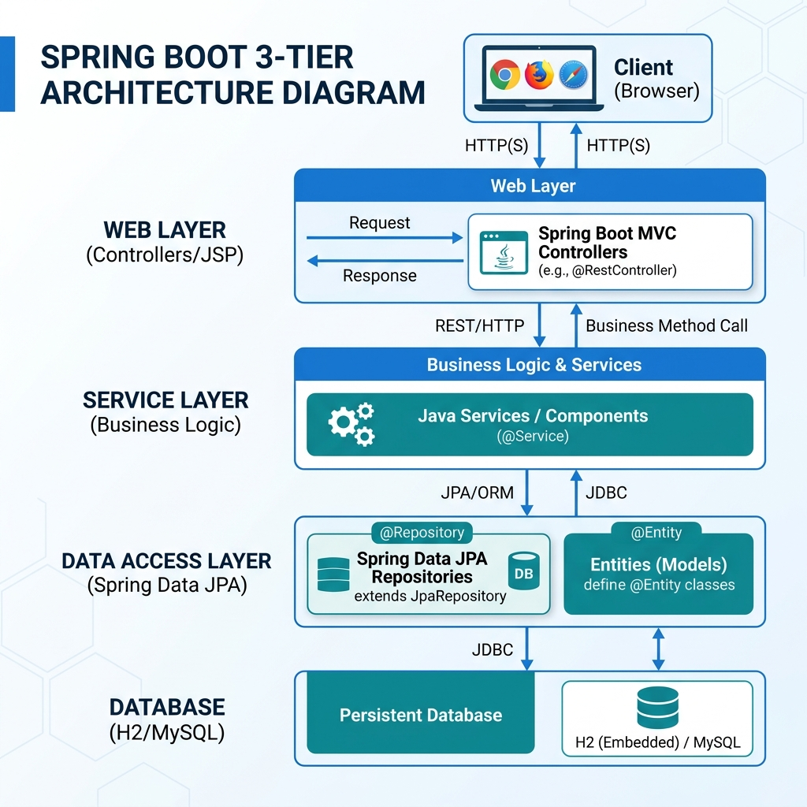
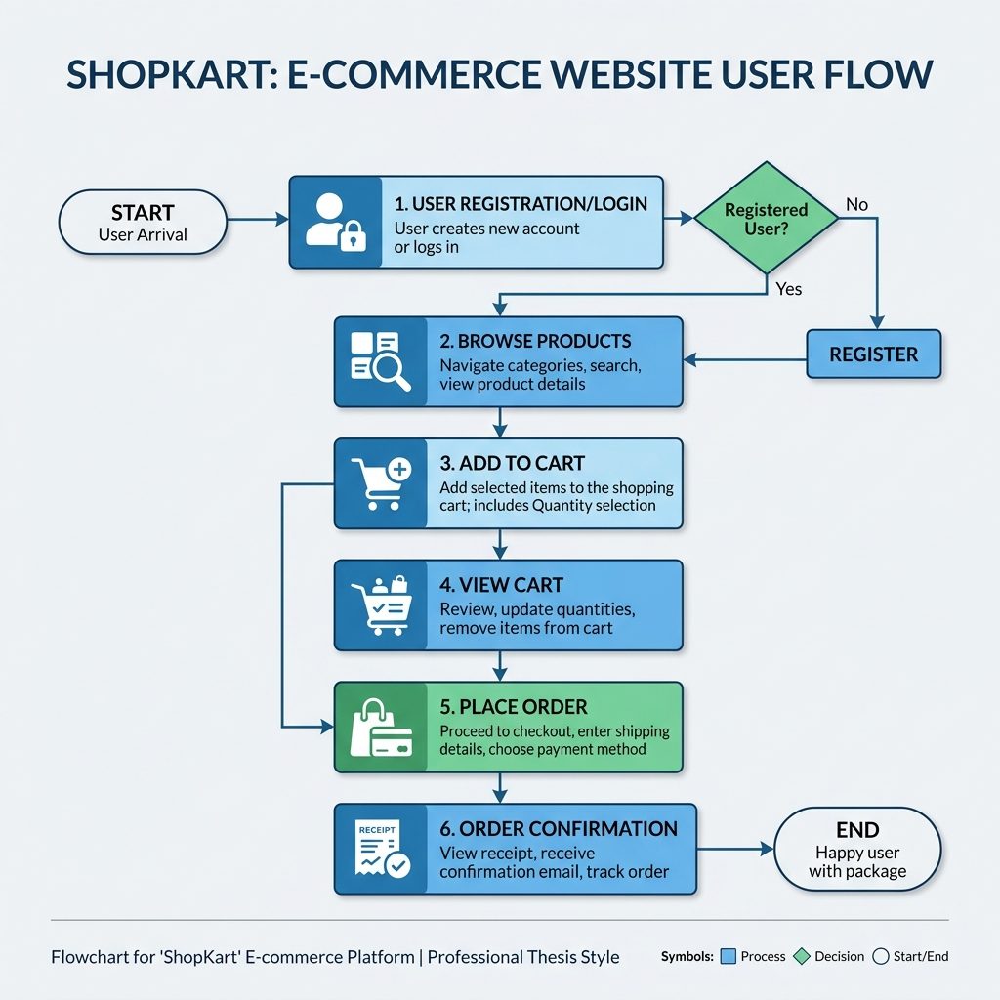

# ShopKart — E-Commerce Web Application
## Final Project Report (Thesis Format)

---

## 1. Title Page

**Project Title:** ShopKart — Web-Based E-Commerce Application Using Spring Boot  
**Domain:** E-Commerce / Information Technology  
**Technologies Used:** Java 17, Spring Boot 3.3.4, Spring MVC, Spring Data JPA, Hibernate, JSP, HTML/CSS/JavaScript, Maven, H2 / MySQL, Docker & Docker Compose, BCrypt Password Security

**Developed By:** Sanket Gabhud  
**Academic Year:** 2025–2026

---

## 2. Certificate
*(Institution letterhead)*

This is to certify that the project report entitled **“ShopKart — Web-Based E-Commerce Application Using Spring Boot”** submitted by **Sanket Gabhud** is a record of bona fide work carried out under my supervision.

**Signature of Guide:** _________________________  
**Date:** _________________________

---

## 3. Abstract

Electronic commerce has become a fundamental channel for retail and service delivery. **ShopKart** is a full-stack style web application built on **Java** and **Spring Boot**, following a classic **Model–View–Controller (MVC)** pattern.

The system distinguishes **customers** and **administrators** through separate entities and session attributes. Customers can register, browse products using category filters or prefix search, manage a persistent shopping cart with stock-aware constraints, and place orders. 

Administrators authenticate with a dedicated **security key** and access a data-driven dashboard. This dashboard tracks key performance indicators (KPIs) such as last week's sales trends, order status distribution (Pending vs Delivered), and identifies top-selling products. Administrative tools provide full CRUD (Create, Read, Update, Delete) capabilities over the product catalog, customer records, and global order management.

The implementation prioritizes security using **BCrypt hashing** for passwords and validates all multipart image uploads. The architecture is designed to be portable, supporting both in-memory H2 databases for development and production-ready MySQL via Docker.

---

## Chapter 1: Introduction

### 1.1 Project Overview
ShopKart is a comprehensive e-commerce platform designed to bridge the gap between traditional retail and digital convenience. Built on the modern Spring Boot framework, it demonstrates a clean separation of concerns and a robust business logic layer.

### 1.2 Objectives
1. **Seamless UX:** Provide an intuitive browse-to-buy journey for customers.
2. **Operational Control:** Empower admins with dashboard analytics and inventory management.
3. **Data Integrity:** Ensure ACID-compliant transactions for orders and stock updates using Spring Data JPA.
4. **Security:** Implement industry-standard password hashing and role-based access control simulation.

---

## Chapter 2: System Design

### 2.1 System Architecture
The application follows a standard N-Tier architecture (Presentation, Business, Data).

*Figure 2.1: High-Level System Architecture Diagram*

### 2.2 Customer Workflow
The sequence of actions for a standard shopping session.

*Figure 2.2: Customer Journey Flowchart*

### 2.3 Database Schema (Key Entities)
| Table | Description |
|---|---|
| **Customer** | Stores user profiles and credentials (hashed). |
| **Product** | Catalog items with stock tracking and pricing details. |
| **Orders** | Transaction records linking customers to specific product quantities. |
| **CartItem** | Intermediate storage for potential purchases. |
| **Admin** | Highly privileged credentials with security key verification. |

---

## Chapter 3: Implementation Detail

### 3.1 Admin Dashboard & Analytics
The Admin Dashboard is the nerve center of the application, providing real-time data visualization.

*Figure 3.1: Admin Analytics & Performance Tracking*

**Key Metrics Tracked:**
- **Sales Trends:** Day-by-day revenue mapping for the last 7 days.
- **Order Health:** Real-time breakdown of Pending, Shipped, and Delivered orders.
- **Inventory Alerts:** Monitoring stock levels across the entire catalog.
- **Customer Activity:** Daily signups and login frequency tracking.

---

## Chapter 4: Testing & Quality Assurance

### 4.1 Functional Test Cases
| ID | Module | Scenario | Expected | Result |
|---|---|---|---|---|
| T1 | Auth | Login with invalid security key | Access Denied | Pass |
| T2 | Cart | Add more than available stock | Quantity Capped | Pass |
| T3 | Order | Cancel a shipped order | Status Updated to 'Cancelled' | Pass |
| T4 | Upload | Upload non-image file as product pic | Validation Error | Pass |

---

## Chapter 5: Conclusion

### 5.1 Summary
ShopKart stands as a production-level prototype for modern e-commerce. By leveraging Spring Boot's ecosystem, the project achieves a high degree of maintainability and feature richness.

### 5.2 Future Scope
- **Payment Integration:** Adding Razorpay/Stripe for real transactions.
- **RESTful API:** Decoupling the frontend for Mobile App support.
- **AI Recommendations:** Suggesting products based on browsing history.

---
*End of Report*
